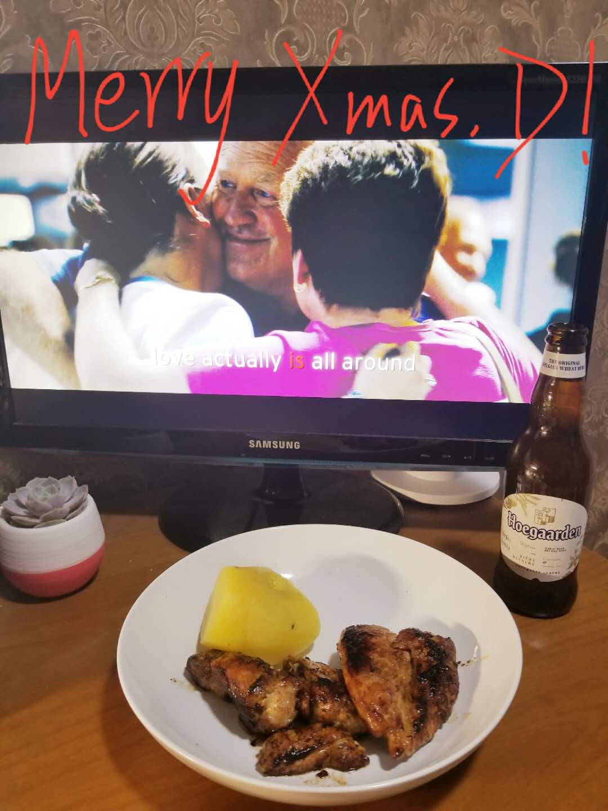

### 1218-1224

- 公司的实验室项目取得初步成果，结果还不错；
- 数据结构的链表部分，对C生疏了不少，不过学习数据结构的过程还是蛮有趣的，总体速度和节奏还可以；

---

- 忘记写翻译了；

- 读完《你一定爱读的极简欧洲史》，后续后时间的话可以做个整理；
- 减重3kg；
- 周五晚上和同事一起玩了几个桌游，其中很喜欢《富饶之城》，后续可以考虑入；
- 平安夜又看了一遍《Love Actually》；

---

- 数据结构；
- 坚持控制饮食和Keep；