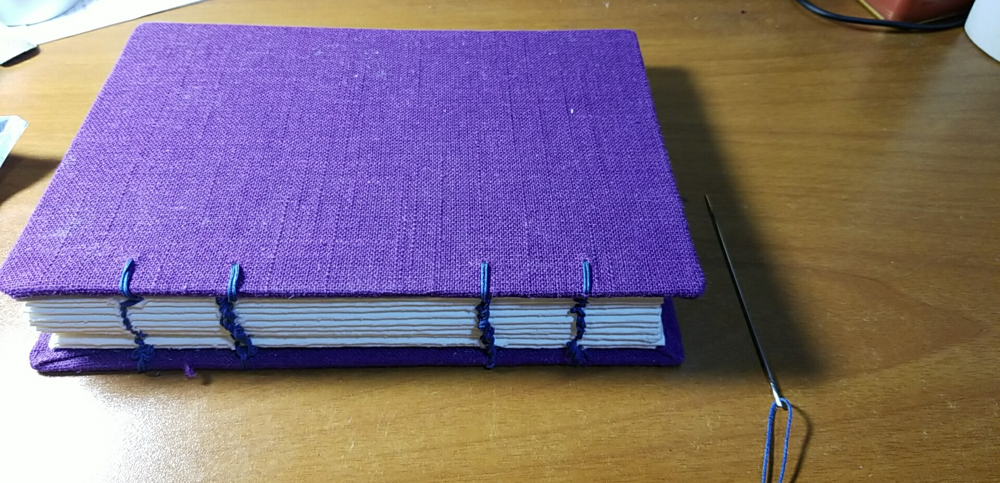

### 0521-0527
- 周一考了数据库的期末考试；
- 这周开始复yù习最优化，由于surface屏幕有些小故障，于是这周探索了一种新的记笔记的方法（并不是笔记术）；
- 之前的项目技术通路的流程跑通，进入测试阶段了；

---

- 周末看了[*Rome Unpacked*](https://www.bilibili.com/video/av18204794/index_2.html?t=3482)，蛮不错的旅行纪录片；
- 把之前看了一半的[*My Last Summer*](https://www.bilibili.com/bangumi/play/ep119109/?t=2767)看完了，最后一集非常泪目；
- 周末在家把之前的手工书做完了；

- 另，最近解锁了一些新的人生体验：

---

