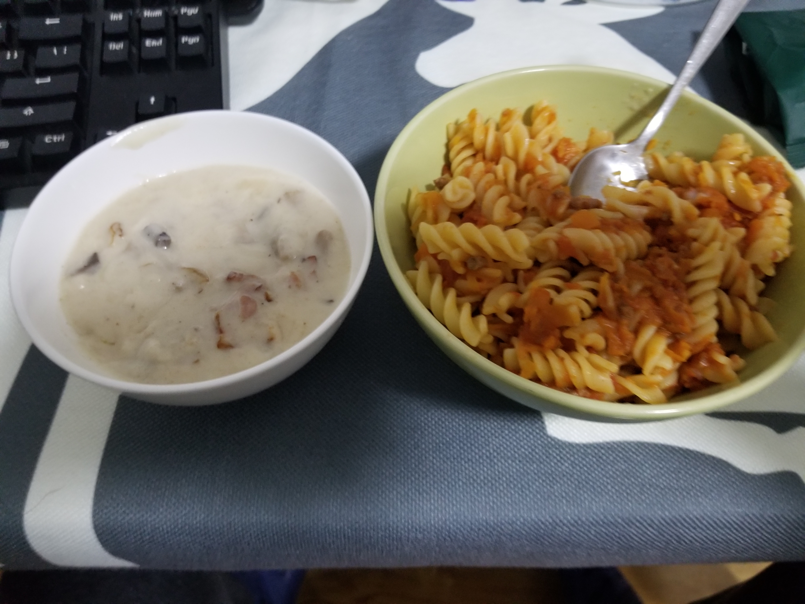

### 1210-1216
- 上周末发现自己的两台ss用的服务器全都联系不上了……所幸周一早上又好了，顺手又给bandwagon那台配了ssr；
- 在python中调用xelatex做LaTeX的渲染，再用pdf2image转成图，洗了一批数据；
- 上了两个api；
- 接手了Hackathon别人的一个项目，用新数据做了重训练；

---
- 看了《扫毒》，硬伤不少，但是看三位影帝对戏真是享受；
- 看了《无人区》，一部残酷的西部片，许多细微之处宁浩导演处理得颇为讲究；
- 听了刘宝瑞先生的《官场斗》，同一段书郭德纲和刘宝瑞的演绎果然是不同，相比之下刘宝瑞先生推进情节的速度快了不少；
- 在Google Play Awards 2018的Best Hidden Gem Apps中发现了SLOWLY，在上面与一位同行的印度小哥来往了几封书信，甚是有趣；
- 周末又一次尝试做Bolognese，这次集齐了应用的材料(Tomato puree, Red Wine和Oregano)，恰逢食材也很新鲜，做出来的Bolognese味道很正，佐以奶油蘑菇汤，甚好（汤是第一次做，面粉炒得不好，还需练习）；

