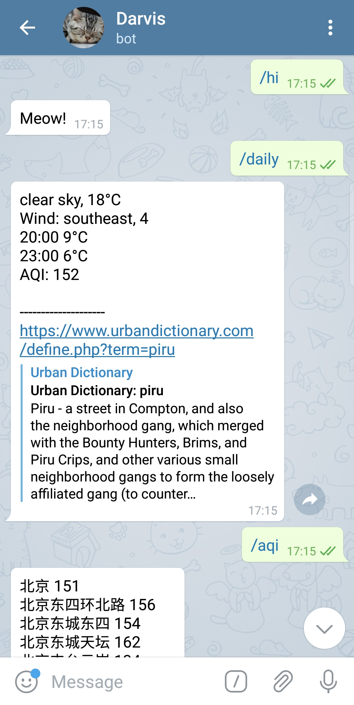
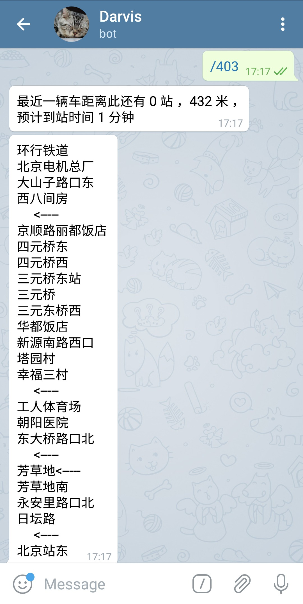

### 0318-0324
- 探究一批外源数据的数据结构，库表众多；
- 这周梯子又炸了，无奈买了一个月的BoomCloud，之后暂时打算自己只维护一个SS服务，炸了就换端口或者重开节点；
- 毕设改进了一下结构，新增了生成有向图的部分；
- 发现Telegram Bot新世界，这周添加了几个CommandHandler，之后打算探索一下JobQueue；

---
- 提高温度烤了一次Chiffon，解决了塌腰的问题；
- 煎了Pancake，用新的Recipe做油泼面；
- 买了春笋做了腌笃鲜，春笋甚好；
