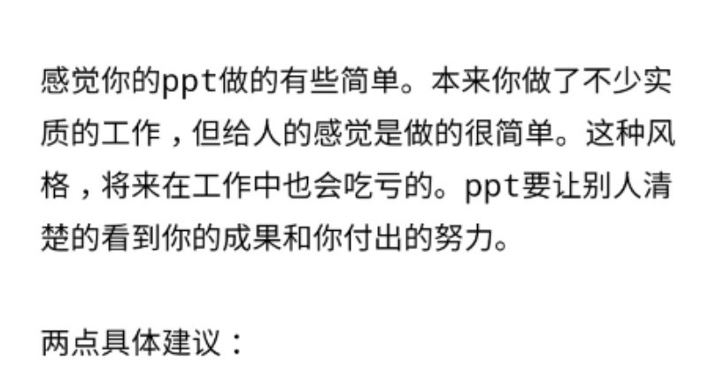

### 0415-0421
- 造了一个数据可视化的壳，过程中用到的大多都是之前已知的，不过造壳速度已经有了非常明显的提升；
- 做了毕设中期报告，给导师发ppt的时候他的回信让我第一次感觉到了他的认真和诚挚，感谢他；

---
- 在看Fargo S02和Game of Thrones S08;
- 玩了《文明》的桌游，规则设置还是挺有新意的；
- 我的1809开始疯狂蓝屏，终于受不了了于是手动回滚到1803了；
- 情绪水平持续走低，想来想去还是应该寻求专业帮助，终于在生日当天去做了第一次心理咨询，总的来说还是高于预期的，除了贵并没有别的缺点；另外当天除此之外，其他的部分加起来只让我感到“二十三岁生日，更想离开这个世界的一天”；
- 受同事推荐读了一点加缪的Le Mythe de Sisyphe，似乎如果还能保持正常的话，可能想要给自己开一个xx主义相关的书单；
- 去杭州过了周末：
    - 原计划的独自旅行，没有完全达成；
    - 四月下旬的杭州，依然很美，这是在没有真切看到西湖的情况下得到的感想，切身体会到了什么叫“天街小雨润如酥”，杭州美景，果然盖世无双；
    - 在西湖南面的九曜山顶上亲眼看到了我理想中的生活的样子；
    - 杭州吃喝水平不俗，两天总共下了五家饭馆，饭馆密集的街巷里饭香袭人，馆子的食材也通常都很新鲜；农贸市场上能见到的食材远比北方丰富得多，在采荷买到了半只很棒的卤鸭；探了两家咖啡店，实力远比看上去强很多，在其中一家喝到了一杯Espresso甜非常突出的Piccolo Latte，在另一家喝到了有奇妙风味的Baby Gesha；很遗憾地忘记在周六晚上去探Bar了；
    - 这次旅行的疗愈作用并没有想象中大，游览和吃喝的时候还好，但其他时候情绪依然会回到低水平，在旅途的最后，还赶上同屋鼾声如雷……
