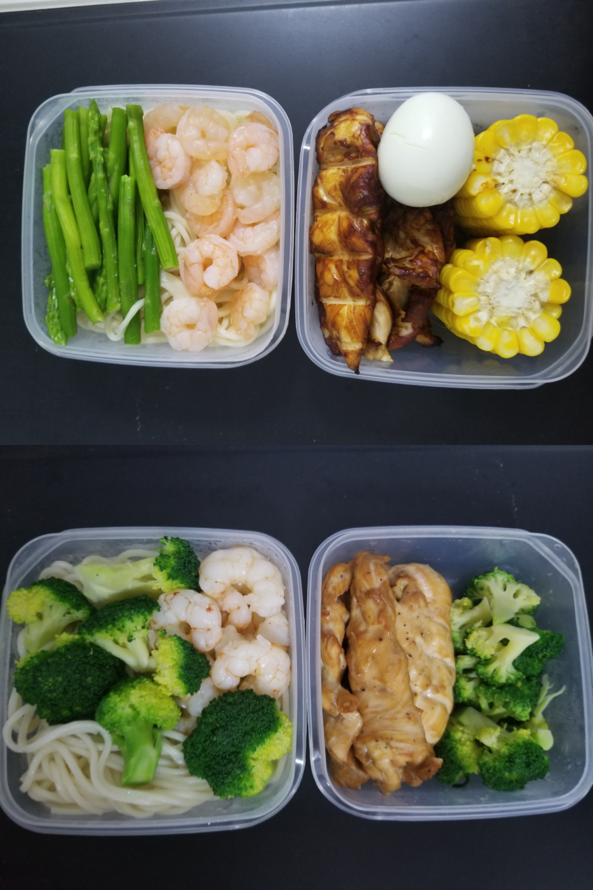

### 0708-0714
- 周一和周二肠胃一直不是很好，总跑肚，难受得很；
- 周二晚上飞回北京；
- 回来的第一天就得知自己要换组换工位了，新的组是大后台，大家做的事情和聊的东西真的很不一样；
- 按照这边同事的调研，我们打算用Go来做AI的工程化，之后要学Go了；
---
- 看了《廉政风云》；
- 在家里招待了张天宇和刘悦，一起吃了火锅，玩了Switch；
- 看了两场温网的比赛，还是很精彩的；
- 这个月因为出勤天数不够多，所以之前选择领饭补自己带饭，这周做了两次便当，目前感觉还不错；

